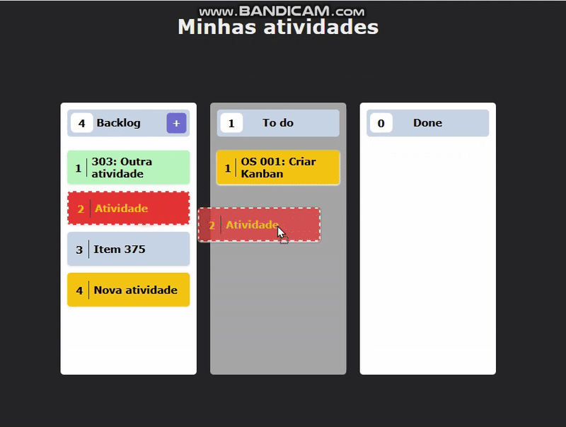
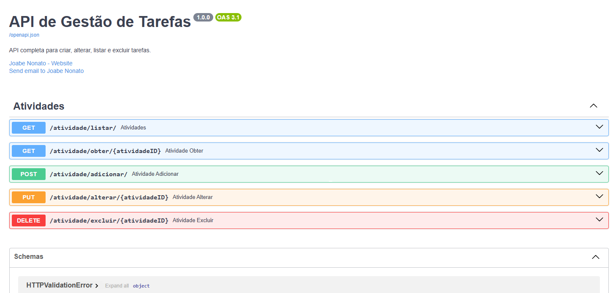

# API de Tarefas
Esta é uma API para gerenciamento de tarefas, desenvolvida em Python utilizando o framework FastAPI. O projeto foi estruturado para ser robusto, escalável e fácil de manter.
- Autor: Joabe Nonato

**“Para uso comercial, entre em contato com o autor para obter uma licença comercial.”**

### Ferramentas e Tecnologias:
<div style="display: flex; gap: 20px; width: 100%; justify-content: space-between; " >


             


     

          

</div>   

## Arquitetura

A aplicação segue uma arquitetura em 3 camadas (Layered Architecture) para garantir uma clara separação de responsabilidades:

-   **Camada de Rotas (`routers`)**: Responsável por definir os endpoints da API, receber as requisições HTTP e retornar as respostas. Ela lida com a validação dos dados de entrada/saída e o tratamento de erros HTTP, traduzindo os resultados da camada de serviço em respostas HTTP significativas (ex: 200, 201, 404, etc.).
-   **Camada de Serviço (`service`)**: Contém a lógica de negócio da aplicação. Ela orquestra as operações, chamando a camada de repositório para acessar os dados. Esta camada é "pura", ou seja, não tem conhecimento sobre o protocolo HTTP, o que a torna reutilizável em diferentes contextos (ex: scripts, outros frameworks).
-   **Camada de Repositório (`repository`)**: É a única camada que interage diretamente com o banco de dados. Ela é responsável por executar as queries (consultas) para criar, ler, atualizar e deletar registros, abstraindo a lógica de persistência de dados.


## Aplicabilidade



## Estrutura do Projeto

```
src/
├── main.py               # Ponto de entrada da aplicação FastAPI
├── README.md             # Esta documentação
├── model/
│   └── tarefa.py         # Define o modelo de dados (Pydantic)
├── routers/
│   └── atividades.py     # Define os endpoints da API
├── service/
│   └── tarefa_service.py # Camada de lógica de negócio
└── repository/
    ├── datasource.py     # Configuração da conexão com o banco
    └── tarefa_repository.py # Camada de acesso aos dados
```

## Endpoints da API

A seguir estão detalhados todos os endpoints disponíveis na API.




---

### 1. Listar todas as Tarefas

-   **Funcionalidade**: Retorna uma lista com todas as tarefas cadastradas.
-   **Método**: `GET`
-   **Endpoint**: `/listar/`
-   **Respostas**:
    -   `200 OK`: Sucesso. Retorna um array de objetos `Tarefa`.
        ```json
        [
            {
                "TarefaID": 1,
                "Fase": "Backlog",
                "Titulo": "Implementar autenticação",
                "Descricao": "...",
                "Tema": "Segurança"
            }
        ]
        ```

---

### 2. Obter uma Tarefa específica

-   **Funcionalidade**: Retorna uma tarefa específica com base no seu ID.
-   **Método**: `GET`
-   **Endpoint**: `/obter/{atividadeID}`
-   **Parâmetros de URL**:
    -   `atividadeID` (int): O ID da tarefa a ser buscada.
-   **Respostas**:
    -   `200 OK`: Sucesso. Retorna o objeto `Tarefa` correspondente.
        ```json
        {
            "TarefaID": 1,
            "Fase": "Backlog",
            "Titulo": "Implementar autenticação",
            "Descricao": "...",
            "Tema": "Segurança"
        }
        ```
    -   `404 Not Found`: A tarefa com o ID especificado não foi encontrada.
        ```json
        { "detail": "Tarefa com ID {atividadeID} não encontrada." }
        ```

---

### 3. Adicionar uma nova Tarefa

-   **Funcionalidade**: Cria uma nova tarefa.
-   **Método**: `POST`
-   **Endpoint**: `/adicionar/`
-   **Corpo da Requisição** (JSON):
    ```json
    {
        "TarefaID": 0,
        "Fase": "TODO",
        "Titulo": "Criar tela de login",
        "Descricao": "Desenvolver o front-end da tela de login.",
        "Tema": "Front-end"
    }
    ```
-   **Respostas**:
    -   `201 Created`: Sucesso. Retorna o objeto `Tarefa` recém-criado, agora com o `TarefaID` preenchido pelo banco de dados.
    -   `500 Internal Server Error`: Ocorreu um erro no servidor ao tentar adicionar a tarefa.
        ```json
        { "detail": "Ocorreu um erro ao adicionar a tarefa." }
        ```

---

### 4. Alterar uma Tarefa existente

-   **Funcionalidade**: Atualiza completamente os dados de uma tarefa existente.
-   **Método**: `PUT`
-   **Endpoint**: `/alterar/{atividadeID}`
-   **Parâmetros de URL**:
    -   `atividadeID` (int): O ID da tarefa a ser alterada.
-   **Corpo da Requisição** (JSON): O objeto `Tarefa` completo com as novas informações. O `TarefaID` no corpo deve ser o mesmo do parâmetro na URL.
    ```json
    {
        "TarefaID": 2,
        "Fase": "In Progress",
        "Titulo": "Criar tela de login (Atualizado)",
        "Descricao": "Desenvolver o front-end da tela de login com validação.",
        "Tema": "Front-end"
    }
    ```
-   **Respostas**:
    -   `200 OK`: Sucesso. Retorna o objeto `Tarefa` com os dados atualizados.
    -   `404 Not Found`: A tarefa com o ID especificado não foi encontrada.
    -   `400 Bad Request`: O ID na URL é diferente do ID no corpo da requisição.

---

### 5. Excluir uma Tarefa

-   **Funcionalidade**: Remove uma tarefa do sistema.
-   **Método**: `DELETE`
-   **Endpoint**: `/excluir/{atividadeID}`
-   **Parâmetros de URL**:
    -   `atividadeID` (int): O ID da tarefa a ser excluída.
-   **Respostas**:
    -   `204 No Content`: Sucesso. A resposta não possui corpo.
    -   `404 Not Found`: A tarefa com o ID especificado não foi encontrada para exclusão.
        ```json
        { "detail": "Tarefa com ID {atividadeID} não encontrada para exclusão." }
        ```

## Como Executar o Projeto

1.  **Instale as dependências:**
    ```bash
    pip install fastapi "uvicorn[standard]" pyodbc pydantic
    ```
2.  **Inicie o servidor:**
    ```bash
    uvicorn main:app --reload
    ```
    A API estará disponível em `http://127.0.0.1:8000`. A documentação interativa (Swagger UI) pode ser acessada em `http://127.0.0.1:8000/docs`.

## Requisitos
- fastapi==0.116.1
- pydantic==2.11.7
- pydantic_core==2.33.2
- pyodbc==5.2.0


## Licença
Este projeto adota um modelo de **Licenciamento Dual**:
- **MIT** (uso livre para estudo, pesquisa e open-source)  
- **Licença Comercial** (necessária para uso em produtos e serviços comerciais)  

Mais detalhes em [LICENSE.md](LICENSE.md).

